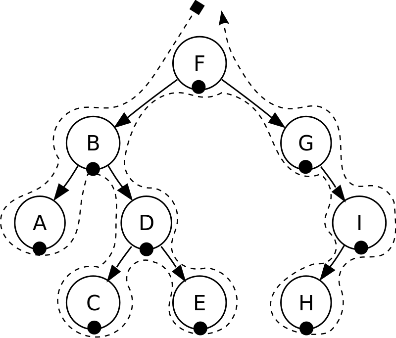
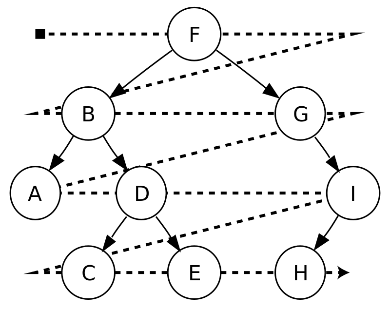

### 树
#### 常用术语:
- 叶子节点: 没有子节点的节点
- 内部节点: 至少有一个子节点的节点
- 边/分支/连接: 将父节点连接到子节点的线
- 路径: 连接一个节点与其后代节点的边的序列
- 路径长度: 路径中边的数目
- 深度/层次: 到根节点的路径长度, 根节点深度为0
- 高度: 最长路径长度
- 子树: 一个节点与其所有子节点形成的树
---
#### 遍历方式:
##### 深度优先遍历:
- 前序遍历:
    
- 中序遍历:
    
- 后续遍历:
    
##### 广度优先遍历:
- 层次遍历:
    